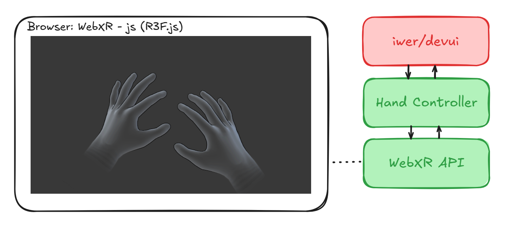
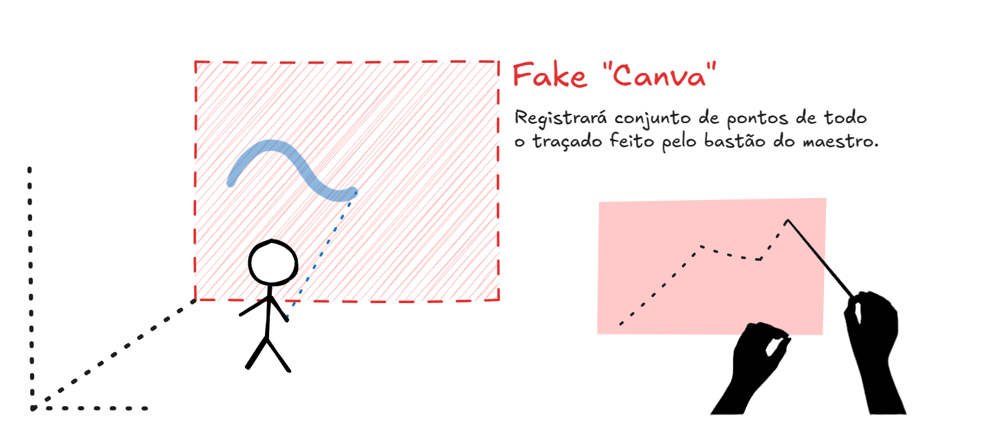
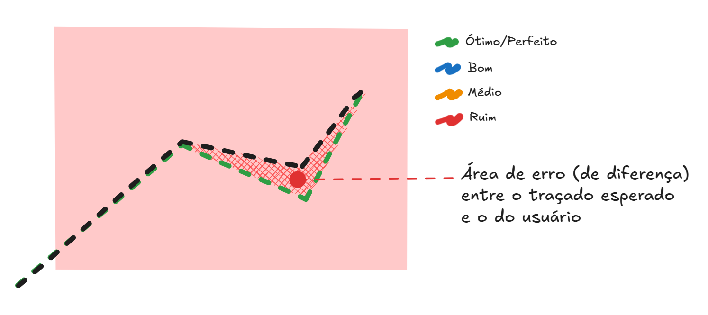

# Maestro Game WebXR

### Planejamento (Rascunho)

### Setup Ambiente XR

Configurar emulador e integração com o projeto para detectar e responder bem às interações com mãos através do rasteamento de sensores do device XR (inicialmente através do emulador)

### Desenho de traçado

Utilizar uma parede invisível há poucos metros do usuário para ser nosso "canva" que obtem todo o traçado feito pela mão do usuário (bastão do maestro).

> **TODO**: pesquisar formas eficiente de registrar esses pontos do traçados

### Diff do Traçado

Encontrar a diferença entre o traçado ideal e o feito pelo usuário; Comparar, calcular e categorizar essa diferença.

> **TODO**: pesquisar formas eficiente de comparar os traçados

### Pontuação

> ...
